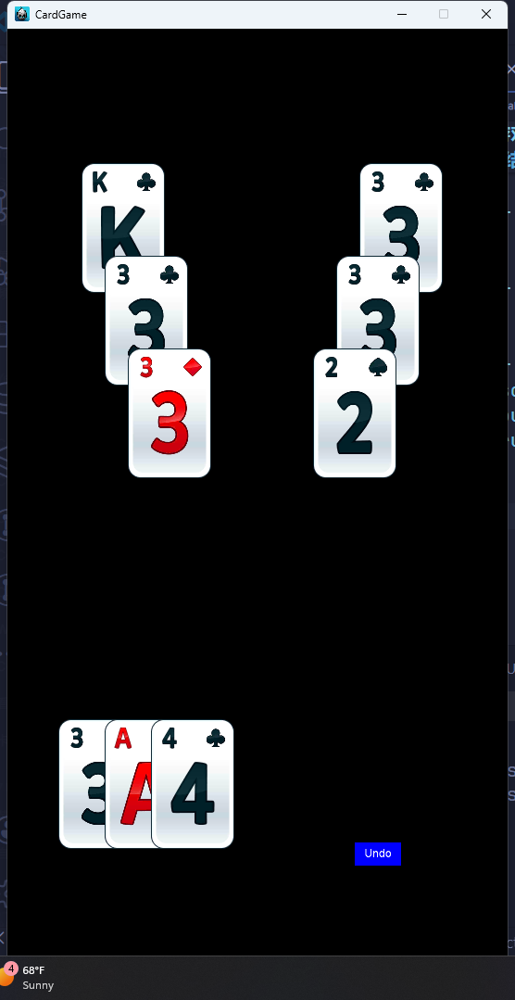

# 纸牌游戏

## 环境

Windows11，cocos2d-x

## 如何运行

1. 将 cocos 游戏引擎目录拷贝到根目录中
2. 执行 `.\build.bat` 文件
3. 执行 `.\run.bat` 文件

## 项目结构图

```
.
├── Classes                     项目逻辑
│   ├── Configs                 配置层
│   │   └── LevelConfigs            关卡配置，用于存储当前关卡的信息
│   ├── Models                  模型层
│   │   ├── GameModel               用于存储各个位置的卡牌牌组
│   │   └── CardModel               用于存储卡牌的基本信息
│   ├── Views                   视图层
│   │   ├── CardView                卡牌视图，用于绘制卡牌，并且接受鼠标点击事件
│   │   ├── GameView                游戏视图，管理卡牌视图和撤销按钮视图，并绘制游戏场景
│   │   └── UndoButtonView          撤销按钮视图，用于绘制撤销按钮，并且接受鼠标点击事件
│   ├── Controllers             逻辑/控制层
│   │   └── GameController          游戏控制，用于设置视图的点击事件的回调函数和整个游戏的基本逻辑
│   ├── Services                服务层
│   │   ├── CardMatcher             卡牌匹配逻辑，用于判断两个卡牌是否能够匹配一起
│   │   └── LevelConfigLoader       关卡配置加载器，用于从文件中读取关卡信息
│   ├── Managers                管理层
│   │   ├── UndoManager             撤销管理，用于记录各种操作和返回上次操作
│   │   └── CardManager             卡牌管理，用于存储卡牌数据
│   └── utils                   工具层
├── Resource                    静态资源
├── .\build.bat                 编译脚本
└── .\run.bat                   运行脚本
```

## 画廊



## 演示视频


